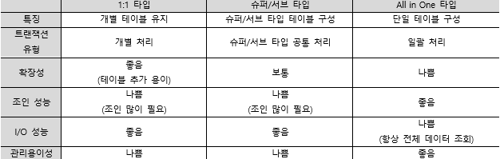

# SQLD

### 1과목 데이터 모델링의 이해

### 데이터 모델

- 모델링: 현실세계를 단순화하여 표현하는 것

  - 특징
    - 추상화: 일정한 형식에 맞춰 표현
    - 단순화: 제한된 표기법이나 언어로 표현함
    - 명확성: 이해가 쉽게 표현

- 데이터 모델링의 중요성 및 유의점

  - 중복 : 같은 시간 같은 데이터 제공
  - 비유연성 : 사소한 업무변화에 데이터 모델이 수시로 변경 x
  - 비일관성 : 신용 상태에 대한 갱신 없이 고객의 납부 이력 정보 갱신 x (연계성 낮게)

- 데이터 모델링 순서

  - 1)개념적: 엔터티와 속성을 도출하고 ERD를 작성함, 업무 중심적이고 포괄적인 수준

    > 엔터티:실체,객체라는 의미. 업무에 필요하고 유용한 정보를 저장하고 관리하기위한 집합
    >
    > ERD :말로서 되어있는 요구분석사항을 그림으로 그려내어 그 관계를 도출하는 것

  - 2)논리적 : 식별자를 도출하고 속성과 관계 등을 정의함, 정규화를 수행하여 데이터
    모델의 독립성과 재사용성  확보

  - 3)물리적 : DB를 구축함 성능 및 보안 등 물리적인 성격 고려

- 데이터 독립성 

  - 논리적 독립성: 외부 스키마가 개념 스키마의 변화에 무관 논리적 사상 없음
  - 물지적 독립성: 개념 스키마가 내부 스키마의 변화에 무관 물리적 사상없음

- 3층 스키마

  - 외부 스키마 : 개개 사용자가 보는 개인적 DB 스키마 사용자 관점
  - 개념 스키마 : 모든 사용자 관점을 통합한 전체 DB  설계자 관점
  - 내부 스키마 : 물리적 장치에서 데이터가 실제적 저장 개발자 관점

- 데이터 모델링 3요소

  - 엔터티, 관계, 속성

- ERD

  - 엔터티는 사각형, 관계는 마름모, 속성은 타원형으로 표현 
    1. 엔터티 도출
    2. 엔터티 배치
    3. 엔터티 간 관계 설정
    4. 관계명 기술
    5. 관계차수 표현: 1:1, 1:N, M:N
    6. 관계선택사양 표현: 필수, 선택

- 좋은 모델링의 요건

  1. 완전성
  2. 중복 배제
  3. 업무 규칙
  4. 데이터 재사용
  5. 의사소통
  6. 통합성

---

- __엔터티__
  - 업무에서 관리해야 하는 데이터의 집합, 명사형, 인스턴스의 집합
  - 특징
    1) 업무에서 필요로 함
    2) 유일한 식별자를 가짐
    3) 2개 이상의 인스턴스를 포함함 
    4) 업무 프로세스에 이용됨
    5) 속성을 가짐
    6) 관계를 가짐
  - 종류
    - 유무형에 따른 분류
      - 유형 엔터티: 물리적 형태가 있고 지속적으로 활용되는 엔터티
      - 개념 엔터티: 물리적 형태가 없는 엔터티
    - 발생시점에 따른 분류
      - 기본 엔터티(key entity): 독립적으로 생성되는 엔터티
      - 중심 엔터티(Main entity): 기본 엔터티와 행위 엔터티의 중간에 존재
      - 행위 엔터티(Active): 2개 이상의 부모 엔터티로부터 발생함
        비즈니스 프로세를 실행하면서 생성되는 엔터티, 지속적으로 정보가 추가되고
        변경되어 데이터양이 가장 많음
    - 명명 규칙
      - 현업업무에서 사용하는 용어 
      - 약어 지양
      - 단수 명사
      - 유일성 보장
      - 명확성

---

- __속성__
  - 엔터티가 가지는 최소 의미 단위, 인스턴스의 구성요소
  - 엔터티와 인스턴스 및 속성값 간의 관계
  - 표기법
    - IE 표기법 Braker 표기법
  - 특징
    - 업무에서 필요하고 관리하고자 하는 정보
    - 주식별자에 함수적으로 종속됨
    - 속성값 하나만 가짐(하나 이상이면 정규화 필요)
  - 종류
    - 특성에 따른 분류
      - 기본 속성: 비즈니스 프로세스에서 도출되는 본래의 속성
      - 설계 속성 : 데이터 모델링 과정에서 업무 규칙화를 위해 발생하는 속성
      - 파생 속성: 다른 속성에 의해 만들어지는 속성
    - 분해 가능 여부에 따른 분류
      - 단일 속성: 하나의 의미
      - 복합 속성: 여러 의미, 단일 속성으로 분해 가능
      - 단일값 속성: 하나의 값
      - 다중값 속성: 엔터티로 분해 가능
    - 엔터티 구성방식에 따른 분류
      - 기본키 속성: 엔터티를 식별할 수 있는 속성
      - 외래키 속성: 다른 엔터티와의 관계에서 포함된 속성
      - 일반 속성: 엔터티에 포함되고 PK나 FK 속성이 아닌 속성
    - 도메인
      - 속성이 가질 수 있는 값의 범위

---

- __관계__

  - 엔터티 간의 논리적인 관련성, 동사형

  - 관계의 패어링: 인스턴스 간 개별적 관계

  - 관계 표기법

    - 관계명, 관계 차수, 관계 선택사양

    > 관계 차수: 관계 내 튜플의 전체 개수
    >
    > 관계 선택사양: 필수는 I 선택은 O로 표시

  - 종류
    - ERD기준 : 표기구분 안함
      - 존재 관계: 엔터티 간의 상태
      - 행위 관계: 엔터티 간에 발생하는 행위
    - UML기준
      - 연관 관계: 실선 표기
      - 의존 관계: 점선 표기
    - 식별자에 따른 분류
      - 식별 관계: 부모 엔터티의 식별자를 자식 엔터티에서 주식별자로 사용
        - 약한엔터티: 부모 엔터티에 종속되어 존재(강한 엔터티는 독립적으로 존재)
      - 비식별 관계: 부모 엔터티의 식별자를 자식 엔터티에서 일반 컬럼으로 참조 사용, 약한 종속
  - 관계 읽기
    - 각각의/하나의 > 기준 엔터티 > 관계차수 > 대상 엔터티 > 관계선택사양 > 관계명

---

- __식별자__

  - 엔터티를 대표할 수 있는 유일성을 만족하는 속성

  - 특징

    - 유일성, 최소성, 불변성, 존재성

  - 종류

    - 대표성 여부에 따른 분류

      - 주식별자: 대표성을 만족하는 식별자
      - 보조 식별자: 유일성과 최소성만 만족하는 식별자, 참조 관계 연결에 사용할 수 없음

    - 생성 여부에 따른 분류

      - 내부 식별자: 자연스럽게 존재하는 식별자
      - 외부 식별자: 다른 엔터티와의 관계를 통해 생성되는 식별자

    - 속성 수에 따른 분류

      - 단일 식별자: 하나의 속성
      - 복합 식별자: 여러 속성

    - 대체 여부에 따른 분류

      - 본질 식별자: 대체될 수 없는 식별자

      - 인조 식별자: 인위적으로 만들어지는 대체가능한 식별자

        - 후보 식별자 중 주식별자로 선정할 것이 없거나
          주식별자가 너무 많은 칼럼으로 구성되어 있을 때 사용

          > 칼럼: 관계형 데이터베이스 테이블에서 특정한 단순 자료형의 일련의 데이터값과 테이블에서의 각 열을 말한다.(=속성)

  - 주식별자 도출 기준

    - 업무에서 자주 이용되는 속성, 이름 명명 지양, 복합 식별자 지양

---

### 데이터 모델과 성능

- 성능 데이터 모델링의 개요
  - 성능 데이터 모델링: DB 성능향상을 위한 사항이 데이터 모델링에 반영되도록 하는 것
  - 수행 시점: 분석/설계 단계, 성능 데이터 모델링 시점이 늦어질수록 재업무 비용이 증가
  - 고려사항: 정규화 수행, DB 용량 산정과 트랜잭션 유형 파악을 통한 반정규화 수행
    __정규화는 무조건 해야함__
- 정규화와 성능
  - 정규화: 데이터 분해과정, 이상현상 제거
    - 정규형: 정규화로 도출된 데이터 모델이 갖춰야 할 특성
  - 함수적 종속성
    - 결정자와 종속자의 관계, 결정자의 값으로 종속자의 값을 알 수 있음
      - 다치 종속: 여러 칼럼이 동일한 결정자의 종속자일 때
  - 정규화 이론
    - 1차2차3차 보이스코드 정규화는 함수적 종속성에 근거
    - 4차 정규화는 다치 종속을 제거
    - 5차 정규화는 조인에 의한 이상현상을 제거하여 정규화를 수행

---

- 반정규화와 성능

  - 반정규화

    - 데이터 중복을 허용하여 조인을 줄이는 DB 성능 향상 방법
    - 데이터의 무결성을 희생하고 조회성능 향상

  - 절차

    - 반정규화 대상 조사: 데이터 처리 범위 및 통계성 등 조사
    - 다른 방법 검토: 뷰, 클러스터링, 인덱스, 애플리케이션
    - 반정규화 적용:정규화 수행 후 반정규화 수행

  - 기법

    - 테이블 반정규화

      - 테이블병합
        - 1:1 관계 테이블 병합
        - 1:N 관계 테이블 병합: 많은 데이터 중복 발생
        - 슈퍼타입/서브타입 테이블 병합
      - 테이블 분할
        - 수직분할
        - 수평분할
      - 테이블 추가
        - 중복 테이블: 업무나 서버가 다를 때 중복 테이블 생성(원격조인 제거)
        - 통계 테이블
        - 이력 테이블
        - 부분 테이블:자주 이용하는 칼럼으로 구성된 테이블 생성

    - 칼럼 반정규화

      - 중복 칼럼 추가

      - 파생 칼럼 추가:필요한 값 미리 계산한 칼럼 추가

      - 이력 테이블 칼럼 추가

      - PK에 의한 칼럼 추가: PK의 종속자를 일반속성으로 생성

        > PK:기본키
        >
        > FK: 외래키

      - 응용 시스템의 오작동을 위한 칼럼 추가

    - 관계 반정규화

      - 데이터 무결성 보장 가능
      - 중복 관계 추가

---

- 대용량 데이터에 따른 성능

  - 블록: 테이블의 데이터 저장 단위

  - 대량 데이터 발생으로 인한 현상: 블록 I/O횟수 증가 ->디스크 I/O 가능성 상승
    (디스크 I/O시 성능 저하)

    > I/O: input/output 약자

    - 로우 체이닝: 행 길이가 너무 길어 여러 블록에 걸쳐 저장되는 현상
    - 로우 마이그레이션: 수정된 데이터가 해당 블록이 아닌 다른 블록의 빈 공간에 저장되는 현상

  - 테이블 분할:반정규화 기법

    - 수직분할: 칼럼 단위로 테이블을 분할하여 I/O를 감소
      너무 많은 칼럼이 있는 경우 사용
    - 수평 분할: 행 단위로 테이블을 분할하여 I/O 감소

  - 파티셔닝

    - 테이블 수평분할기법, 논리적으로는 하나의 테이블이지만 물리적으로 여러 데이터 파일에
      분산 저장, 데이터 조회 범위를 줄여 성능 향상
    - Range Partition: 데이터 값의 범위를 기준으로 분할
    - List Partition: 특정한 값을 기준으로 분할
    - Hash  Partition: 해시 함수를 적용하여 분할,데이터 위치 알 수 없음
    - Composite Partition: 여러 파티션 기법을 복합적으로 사용하여 분할

---

- DB 구조와 성능

  - 슈퍼타입/서브타입 데이터 모델 변환을 통한 성능 향상

    - 슈퍼타입/서브타입 데이터모델: 속성을 할당하여 배치하는 수평 분할된 형태의 모델

    - 변환 기준: 데이터 양. 트랜잭션 유형

    - 변환 기술

      - 1:1 타입: 개별로 처리하는 트랜잭션에 대해 개별 테이블 구성
      - 슈퍼.서브 타입: 슈퍼타입과 서브타입을 공통으로 처리하는 트랜잭션에 대해 슈퍼타입과 서브타입 각각의 테이블 구성
      - All in One 타입: 일괄 처리하는 트랜잭션에 대해 테이블 구성

      > 트랜잭션: 데이터베이스의 상태를 변환시키는 하나의 논리적 기능을 수행하기 위한 작업의 단위 또는 한꺼번에 모두 수행되어야 할 일련의 연산들

      

  - PK/FK 칼럼 순서 조절을 통한 성능 향상

    - 등호 조건이나 BETWEEN 조건이 걸리는 칼럼을 앞으로 이동

  - 인덱스 특성을 고려한 PK/FK DB 성능 향상

    - 물리적인 테이블에 FK제약을 걸어 인덱스를 생성

---

- 분산 DB 데이터에 따른 성능
  - 분산DB: 분산된 DB를 하나의 가상 시스템으로 사용할수 있도록한 DB
    물리적 사이트는 분산되어 있으나 논리적으로 동일한 시스템
  - 설계방식
    - 상향식: 지역 스키마 작성 후 전역 스키마 작성
    - 하향식: 전역 스키마 작성 후 지역사상 스키마 작성
  - 장점
    - 신뢰성, 가용성 증가
    - 빠른 응답 속도와 통신비용 절감
    - 용량 확장 용이
  - 단점
    - 관리 및 통제 어려움
    - 데이터 무결성 관리 어려움
    - S/W개발 비용 및 처리 비용 증가
    - 불규칙한 응답 속도
  - 분산DB의 투명성
    - 분할 투명성: 하나의 논리적 관계가 분할되어 각 단편의 사본이 여러 사이트에 저장
    - 위치 투명성: 사용하려는 데이터 저장 장소가 명시되지 않아도 됨
    - 지역사상 투명성: 지역 DBMS와 물리적 DB 사이의 사상이 보장됨
    - 중복 투명성: DB 객체 중복 여부 몰라도 됨
    - 장애 투명성: 구성요소의 장애에 무관하게 트랜잭션의 원자성이 유지됨
    - 병행 투명성: 다수의 트랜잭션을 도시 수행했을 때 결과의 일관성이 유지됨(병렬 아님)
  - 분산 DB 적용 기법
    - 테이블 위치 분산: 설계된 테이블의 위치를 분산함
    - 테이블 분할 분산: 테이블을 쪼개서 분산(수평분할,수직분할)
    - 테이블 복제 분산: 동일한 테이블을 다른 지역이나 서버에서 동시 생성, 원격지 조인을 
      내부조인으로 변경-부분복제,광역복제
    - 테이블 요약 분산
      - 분석요약:사이트 별 요약정보를 본사에서 통합하여 전테 요약정보 산출
      - 통합요약: 사이트 별 정보를 보사에서 통합하여 전체 요약정보 산출

